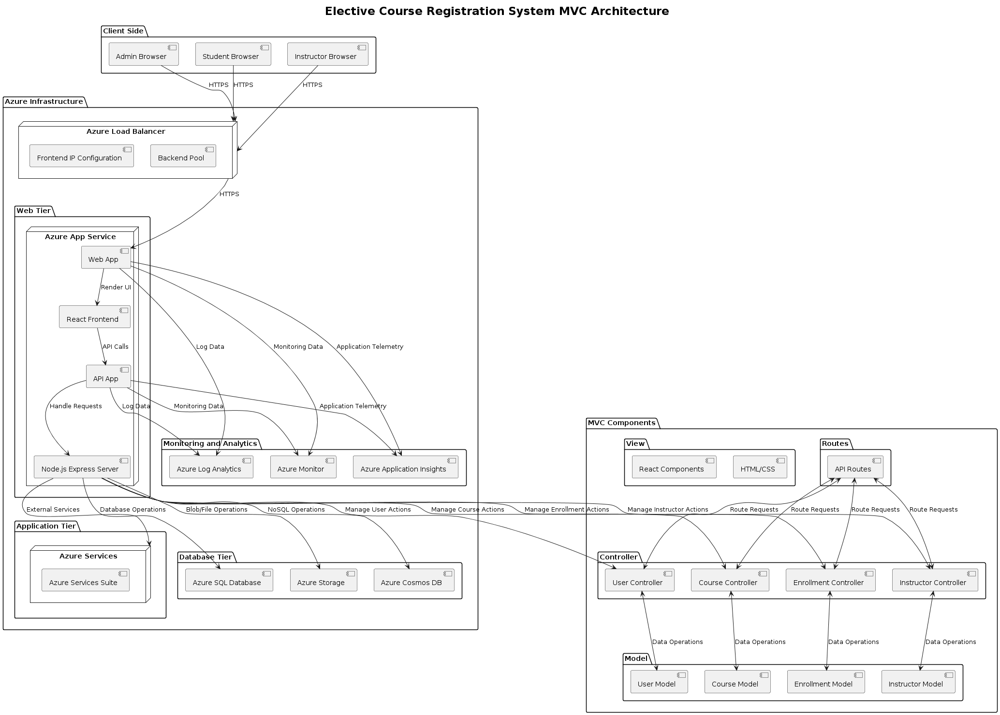

# 🎓 Online Course Registration System 📚

Welcome to the **Online Course Registration System** project! This repository presents a comprehensive design and documentation for a next-generation course registration system aimed at enhancing user experience for students, faculty, and administrative staff.

## 🚀 Project Overview

Educational institutions often struggle with outdated course registration systems that are frustrating and inefficient. Our project aims to address these issues by offering:

- **User-Friendly Interface**
- **Real-Time Updates**
- **Enhanced Accessibility**
- **Scalability During Peak Periods**
- **Personalized Course Recommendations**

## ✨ Features

### User-Friendly Interface
- 🎨 Intuitive navigation
- 📝 Clear instructions
- 📊 Visually appealing design

### Real-Time Updates
- 🔄 Accurate course availability
- 📲 Automated notifications

### Enhanced Accessibility
- 📱 Responsive web design
- ☁️ Cloud-based infrastructure

### Scalability
- 📈 Capacity planning
- 🛠️ Infrastructure scaling strategies

### Personalized Recommendations
- 🧠 Machine learning-based engine
- 👩‍🏫 Validated by academic advisors

## 🏛️ Architecture

### Overview



### MVC Architecture

- **Model:** Manages data and business logic
- **View:** Renders UI components
- **Controller:** Handles user input and updates the model

### Deployment Architecture


- Utilizes Azure for cloud deployment
- Scalable and reliable infrastructure

## 🛠️ Installation

### Prerequisites
- Node.js
- npm
- MongoDB
- Azure account

### Steps

1. **Clone the repository:**
    ```sh
    git clone https://github.com/yourusername/course-registration-system.git
    cd course-registration-system
    ```

2. **Install dependencies:**
    ```sh
    npm install
    ```

3. **Set up environment variables:**
    ```sh
    cp .env.example .env
    # Edit .env file with your configuration
    ```

4. **Run the application:**
    ```sh
    npm start
    ```

5. **Open your browser and navigate to:**
    ```
    http://localhost:3000
    ```

## 📝 Usage

### Student Portal

- **Browse Courses:** Explore available courses with advanced filters.
- **Enroll:** Secure your spot in preferred courses.
- **Schedule:** Check and manage your course schedule.

### Administrator Dashboard

- **Manage Courses:** Add, update, and delete course listings.
- **Monitor Enrollment:** Track trends and manage capacities.
- **Collect Feedback:** Analyze student feedback for continuous improvement.

### Faculty Interface

- **Update Information:** Keep course details current.
- **Monitor Enrollments:** View and manage course enrollments.
- **Communicate:** Send updates and information to enrolled students.

## 📚 User Stories

### As a Student

1. **Browsing and Searching Courses:**
   - I want to browse a list of available elective courses.
   - I want to search for courses by keywords, course codes, or instructor names.

2. **Reading Course Descriptions:**
   - I want to read short descriptions of each elective course.

3. **Favoriting and Comparing Courses:**
   - I want to mark courses as favorites.
   - I want to compare up to three courses side-by-side.

4. **Checking Schedule Compatibility:**
   - I want to see how my selected courses fit into my existing schedule.

5. **Enrolling in Courses:**
   - I want to easily enroll in my selected courses through the application.

### As a College Administrator

1. **Managing Course Listings:**
   - I want to manage the list of available elective courses.

2. **Monitoring Enrollment Trends:**
   - I want to monitor enrollment trends and popular courses.

3. **Handling Prerequisites and Conflicts:**
   - I want to ensure that students are informed about prerequisites and potential scheduling conflicts.

4. **Facilitating Registration Integration:**
   - I want to integrate the application with the college’s registration system.

5. **Collecting Student Feedback:**
   - I want to collect and analyze student feedback.

### As a Faculty Member

1. **Creating and Updating Course Information:**
   - I want to create and update the information for the courses I teach.

2. **Monitoring Enrollment Numbers:**
   - I want to monitor the enrollment numbers for my courses.

3. **Receiving Student Feedback:**
   - I want to read reviews and feedback from students.

4. **Communicating with Students:**
   - I want to communicate with students who have enrolled in my courses.

5. **Reviewing Enrollment Prerequisites:**
   - I want to review the prerequisites for my courses.

## 🔍 Non-Functional Requirements

- **Accessibility:** Quick access to the software.
- **Usability:** Easy navigation.
- **Security:** Secure data storage.
- **Recovery:** Quick system recovery.
- **Dashboard Services:** Comprehensive list of services.

## 📐 Design Diagrams

### Use Case Diagram


### Class Diagram


### Sequence Diagram


## 🧪 Test Strategy and Test Cases

### Test Strategy
- Comprehensive testing approach to ensure all components meet requirements.

### Test Cases
- Detailed scenarios including inputs, expected outcomes, and validation criteria.

## 🚀 Deployment Architecture

### Deployment Diagram


### Azure Deployment


- Utilizes Azure for cloud deployment.
- Ensures scalability and reliability.

## 🌟 Contributing

We welcome contributions from the community! Please follow these steps:

1. **Fork the repository.**
2. **Create a new branch:**
    ```sh
    git checkout -b feature/your-feature
    ```
3. **Commit your changes:**
    ```sh
    git commit -m "Add some feature"
    ```
4. **Push to the branch:**
    ```sh
    git push origin feature/your-feature
    ```
5. **Open a pull request.**

Please make sure to update tests as appropriate.

## 👥 Team Members

- **RAKHUL PRAKASH S B** - 220701216
- **ROSHINI V S** - 220701229
- **REUBEN ABRAHAM GEORGE** - 220701223
- **RAGHUL S** - 220701210
- **SADHANA A** - 220701235
- **PREM KUMAR D** - 220701204


---

Thank you for visiting our project! We hope this design documentation enhances your understanding and approach towards creating a better course registration system. If you have any questions or feedback, feel free to reach out. Happy coding! 🎓📚

---
